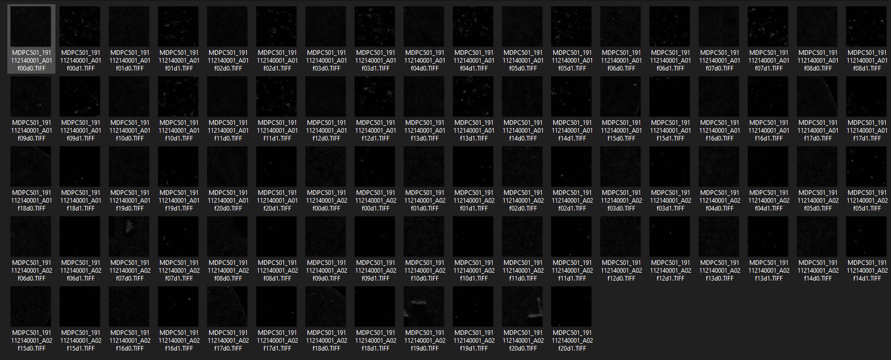
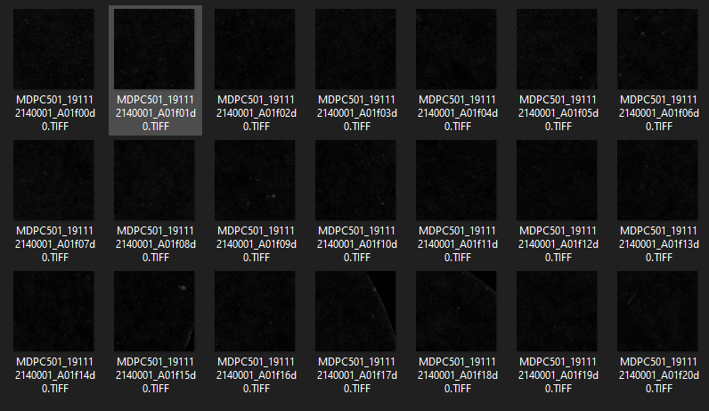
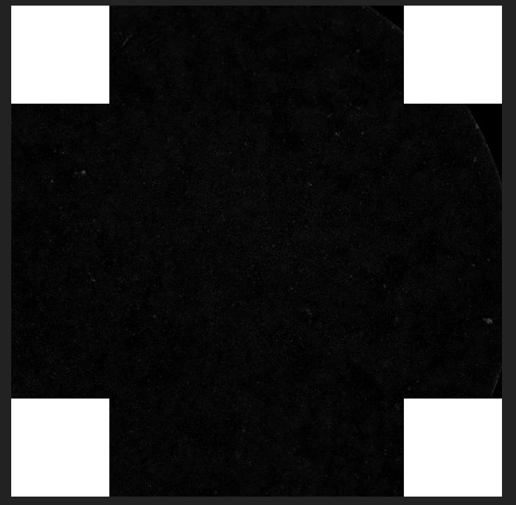
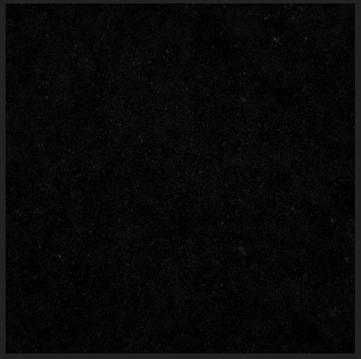

# PyMerge

An automatic python script to merge images.

You will need to install OpenCV for python. Use `pip` to install the package.

```
	pip install --user opencv-python
```

Written in Python 64-bit version `3.7.4` with `OpenCV2`

## How to use

```
	# Please set the following parameters at your ease
	PATH = 'images/'
	OUTPUT_PATH = 'output/'
	PICTURE_NUMBER = 'A02'
	PICTURE_CHANNEL = 'd1'
	DIRECTION_FLAG = 'anticlockwise' # 'anticlockwise' or 'clockwise'
```

`PATH` is the directory where you will need to put your images. No file clean-ups need
to be done as this python tool automatically picks out the subimages you need.

`OUTPUT_PATH` is where the merged image will be stored.

`PICTURE_NUMBER` refers to the number generated by the imaging machine, it has the format
of `A01`, `A02`, etc.

`PICTURE_CHANNEL` refers to the channel (visible and IR spectrum?).

Properly select the algorithm by setting up the direction flag `DIRECTION_FLAG`, type either
`anticlockwise` or `clockwise`

Please make sure these are set appropriately.

All other operations will be done automatically.

## Screenshots

The original subimages:


Automatically sorted subimages:


Output with 20 subimages and auto-filled corners:


Output with 9 subimages

